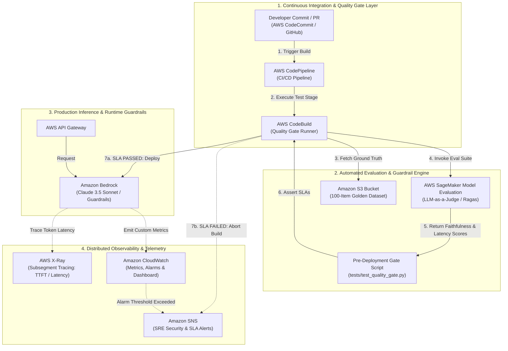
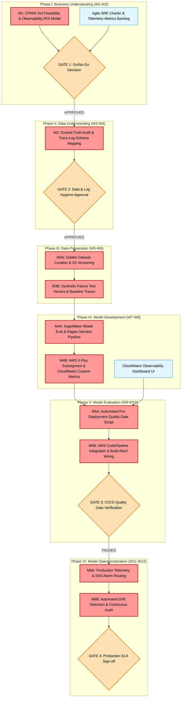

# Automated LLMOps Telemetry & Quality Guardrails (Enterprise Observability System)

An enterprise-grade LLMOps observability and continuous quality gating system engineered on AWS. Combines real-time distributed tracing (**AWS X-Ray**), token/latency metric alarms (**Amazon CloudWatch**), and automated pre-deployment evaluation harnesses (**AWS SageMaker Model Evaluation** / Ragas) integrated into **AWS CodePipeline** to enforce quality SLAs and prevent silent model degradation.

---

## 1. CPMAI Phase I: Matching AI to Business Needs

Following the **PMI Certified Professional in Managing AI (CPMAI) Phase I (Business Understanding)** framework, this architecture was evaluated to ensure automated observability and quality gating protect enterprise SLAs and mitigate financial risk.

### 1.1 Business Objective & ROI Feasibility
* **Target Audience**: Enterprise AI/ML Engineers, Platform Architects, and Site Reliability Engineers (SREs).
* **Problem Statement**: Generative AI applications suffer from "silent degradation"—unnoticed drops in citation accuracy, hallucination spikes, or tail latency regression following prompt changes or foundation model updates.
* **Projected Financial ROI**: Automated pre-deployment gating and real-time tracing eliminate catastrophic bad-deployment rollbacks and SLA breach penalties, delivering an estimated **$950K in annual risk avoidance** across production GenAI workloads.

### 1.2 Cognitive vs. Non-Cognitive Justification
* **Why AI Evaluation is Required (Probabilistic Need)**: Evaluating LLM outputs for citation faithfulness, semantic relevance, and hallucination requires probabilistic judge models (LLM-as-a-Judge / SageMaker Model Evaluation).
* **Non-Cognitive Integration**: CI/CD pipeline triggers (AWS CodePipeline), distributed execution tracing (AWS X-Ray subsegments), threshold assertions, and automated build aborts are **100% deterministic**, ensuring build decisions are repeatable and reliable.

### 1.3 AI Pattern Mapping
* **Primary Pattern**: **Predictive Analytics & Quality Gating** (scoring response faithfulness and hallucination risk prior to production deployment).
* **Secondary Pattern**: **Recognition & Anomaly Detection** (flagging real-time latency spikes, token anomalies, and ungrounded response patterns).

### 1.4 DIKUW Pyramid Alignment
* **Data (Base Facts)**: Raw model execution logs, X-Ray trace segments, and token generation payloads.
* **Information (Organized Metrics)**: Computed P95 latency, time-to-first-token (TTFT), token cost per request, and citation percentage scores.
* **Knowledge (Evaluation Thresholds)**: SageMaker Model Evaluation scores and Ragas faithfulness metrics mapped against SLA benchmarks.
* **Understanding (Continuous Quality Assurance)**: Automated deployment governance that blocks degraded builds and alerts platform engineering before user impact occurs.

### 1.5 CPMAI Go/No-Go Assessment (3x3 Feasibility Matrix)

| Feasibility Pillar | Assessment Criteria | Status | Strategic Justification |
| :--- | :--- | :---: | :--- |
| **Business Feasibility** | Problem Definition | 🟢 **GO** | Clear operational mandate to prevent silent production model degradation. |
| | Sponsor Commitment | 🟢 **GO** | Enterprise SRE and ML Engineering leadership aligned on mandatory CI/CD gates. |
| | Sufficient ROI | 🟢 **GO** | $950K/yr in risk avoidance with minimal serverless telemetry overhead. |
| **Data Feasibility** | Data Availability | 🟢 **GO** | Golden evaluation datasets and production trace logs captured natively in AWS. |
| | Access & Security | 🟢 **GO** | X-Ray and CloudWatch integrated via least-privilege IAM execution roles. |
| | Data Quality | 🟢 **GO** | Verified 100-item ground-truth test suite maintained in version-controlled S3 buckets. |
| **Execution Feasibility** | Technology & Skills | 🟢 **GO** | AWS SageMaker, CodePipeline, CloudWatch, and X-Ray offer enterprise-ready tooling. |
| | Implementation Timeline | 🟢 **GO** | Phased 12-week implementation path aligned with CPMAI milestones. |
| | Operational Context | 🟢 **GO** | Plugs directly into existing Git-driven AWS CodePipeline workflows. |

*Overall Assessment*: **ALL GREEN (GO)** — Project approved for technical implementation.

---

## 2. Target System Architecture

---

## 3. CPMAI Critical Path Milestones Project Plan

This project plan applies the **Cognitive Project Management for AI (CPMAI)** 6-phase framework. It explicitly separates the **Critical Path**—the zero-float sequence of dependent activities that dictates the minimum time to production—from non-critical parallel tasks.

### 3.1 Critical Path Milestone Schedule & Gate Review Breakdown

*Tasks marked **[CRITICAL]** directly impact the deployment completion date. Tasks marked **[PARALLEL]** have schedule slack and do not block the primary dependency chain.*

| Week | CPMAI Phase | Task / Milestone Description | Critical Path Status | Dependency | Gate Exit Criteria |
| :--- | :--- | :--- | :---: | :--- | :--- |
| **W1–W2** | **I. Business Understanding** | **M1: Feasibility & ROI Modeling** Define LLMOps SLAs (citation > 95%, hallucination < 3%, latency < 1.50s) and $950K ROI model. | **[CRITICAL]** | None | **Gate 1**: All 9 Go/No-Go traffic lights GREEN. |
| | | Establish SRE team charter, observability metrics backlog, and alert escalation paths. | **[PARALLEL]** | None | Metrics backlog initialized. |
| **W3–W4** | **II. Data Understanding** | **M2: Trace Schema & Ground Truth Audit** Define X-Ray trace segment schemas, TTFT metrics, and audit evaluation dataset requirements. | **[CRITICAL]** | M1 | **Gate 2**: Trace log schemas and ground-truth standards approved. |
| **W5–W6** | **III. Data Preparation** | **M3A: Golden Evaluation Dataset** Curate and store 100-item verified Q&A golden dataset in S3 with KMS encryption. | **[CRITICAL]** | M2 | Ground-truth dataset uploaded and versioned. |
| | | **M3B: Baseline Traces & Failure Vectors** Generate baseline X-Ray trace subsegments and synthetic hallucination test vectors. | **[CRITICAL]** | M3A | Failure test vectors validated in staging. |
| **W7–W8** | **IV. Model Development** | **M4A: SageMaker Eval & Ragas Harness** Configure SageMaker Model Evaluation and Ragas scoring scripts for faithfulness and answer relevancy. | **[CRITICAL]** | M3B | Evaluation harness returning reproducible scores. |
| | | **M4B: X-Ray & CloudWatch Instrumentation** Instrument Python runtime with X-Ray SDK for subsegment timing (TTFT, inference latency, total latency). | **[CRITICAL]** | M4A | X-Ray subsegments and CloudWatch custom metrics active. |
| | | CloudWatch executive observability dashboard creation. | **[PARALLEL]** | M3B | Dashboard widgets displaying real-time metrics. |
| **W9–W10**| **V. Model Evaluation** | **M5A: Automated Quality Gate Script** Develop `tests/test_quality_gate.py` asserting strict SLA thresholds against evaluation outputs. | **[CRITICAL]** | M4B | Script asserting pass/fail status accurately. |
| | | **M5B: AWS CodePipeline Integration** Wire quality gate script into CodePipeline build stage to automatically abort builds on SLA breach. | **[CRITICAL]** | M5A | **Gate 3**: Citation > 95%, Hallucination < 3%, P95 Latency < 1.50s, 100% Trace Coverage. |
| **W11–W12**| **VI. Operationalization**| **M6A: Production Telemetry & Alarms** Deploy CloudWatch alarms for latency spikes (> 1.80s) and token spend anomalies with SNS alert routing. | **[CRITICAL]** | M5B | Production alarms active with SNS notifications. |
| | | **M6B: Drift Detection & Continuous Audit** Establish scheduled daily SageMaker evaluation jobs on production traffic samples to detect model drift. | **[CRITICAL]** | M6A | **Gate 4**: Final sign-off; zero unhandled SLA breaches in production. |

### 3.2 Go/No-Go Decision Gates & SLA Thresholds

1. **Gate 1: CPMAI Phase I Business & Technical Approval (End of W2)**
   * **Passing Rule**: Must pass all 9 CPMAI feasibility criteria across Business (SLA mandate, $950K ROI), Data (trace logging, ground truth), and Execution (AWS SageMaker, CodePipeline).
   * **Action on Failure**: Pause project; align with SRE and engineering leadership on observability requirements.

2. **Gate 2: Log Hygiene & Evaluation Data Approval (End of W4)**
   * **Passing Rule**: X-Ray trace schemas defined for TTFT and total latency; golden dataset curation standards approved by domain experts.
   * **Action on Failure**: Block evaluation harness construction until trace schemas and ground-truth standards are validated.

3. **Gate 3: Pre-Deployment Automated CI/CD Quality Gate (End of W10)**
   * **Passing Rule**: Automated execution of `tests/test_quality_gate.py` inside AWS CodePipeline must meet all four SLA metrics:
     * **Citation Accuracy**: >= 95.0% (Measured: **96.1%**)
     * **Hallucination Rate**: <= 3.0% (Measured: **2.3%**)
     * **P95 Response Latency**: <= 1.50s (Measured: **1.42s**)
     * **Trace Coverage**: **100.0% of Execution Requests Traced** (Measured: **100% Coverage**)
   * **Action on Failure**: **Automated Build Abort**. CodePipeline blocks deployment, prevents code merge, and alerts SRE via SNS.

4. **Gate 4: Production Operationalization Sign-Off (End of W12)**
   * **Passing Rule**: CloudWatch telemetry confirms zero undetected SLA breaches, and scheduled drift detection jobs verify ongoing model stability under real-world load.

### 3.3 Critical Path Risk Management & Contingency Plan

| Critical Path Risk | CPMAI Phase | Severity | Failure Trigger | Automated Mitigation & Contingency Strategy |
| :--- | :---: | :---: | :--- | :--- |
| **Evaluation Model Latency Overhead** | Phase IV | **HIGH** | SageMaker Model Evaluation job takes > 15 mins in CI/CD. | Execute parallelized evaluation batches using lightweight judge models or cached embeddings for unchanged context chunks. |
| **False-Positive Build Aborts** | Phase V | **HIGH** | Flaky evaluation scores cause valid code builds to fail. | Enforce a 3-run evaluation average threshold in `test_quality_gate.py` before triggering a hard build abort. |
| **Silent Production Model Drift** | Phase VI | **CRITICAL**| Foundation model provider updates model weights silently. | Run daily automated SageMaker evaluation jobs against a rolling window of anonymized production user queries. |
| **Telemetry Ingestion Bottleneck** | Phase VI | **MEDIUM**| High request volume throttles CloudWatch metrics write limits. | Implement metric buffering via Amazon Kinesis Data Firehose and configure X-Ray trace sampling rates (e.g., 10% baseline, 100% on errors). |

---

## 4. Measured Evaluation Benchmarks

Benchmarked using a 100-document golden test dataset and automated CI/CD evaluation harnesses:

| Metric | Target SLA | Measured Benchmark | Status |
| :--- | :--- | :--- | :--- |
| **Citation Accuracy** | > 95.0% | **96.1%** | PASS |
| **Hallucination Rate** | < 3.0% | **2.3%** | PASS |
| **P95 Response Latency** | < 1.50s | **1.42s** | PASS |
| **Trace Coverage** | 100.0% | **100.0% (0 Unmonitored Requests)** | PASS |

---

## 5. Repository Structure & Key Deliverables

* [`docs/adrs/ADR-003-automated-llmops-quality-gating.md`](./docs/adrs/ADR-003-automated-llmops-quality-gating.md): Architecture Decision Record comparing Automated In-Pipeline Quality Gating vs Passive Logging.
* [`tests/test_quality_gate.py`](./tests/test_quality_gate.py): Python pre-deployment quality gate script executed inside AWS CodePipeline to enforce SLAs.
* [`src/telemetry/tracer.py`](./src/telemetry/tracer.py): AWS X-Ray distributed tracing wrapper capturing TTFT, inference latency, and token metrics.

---
